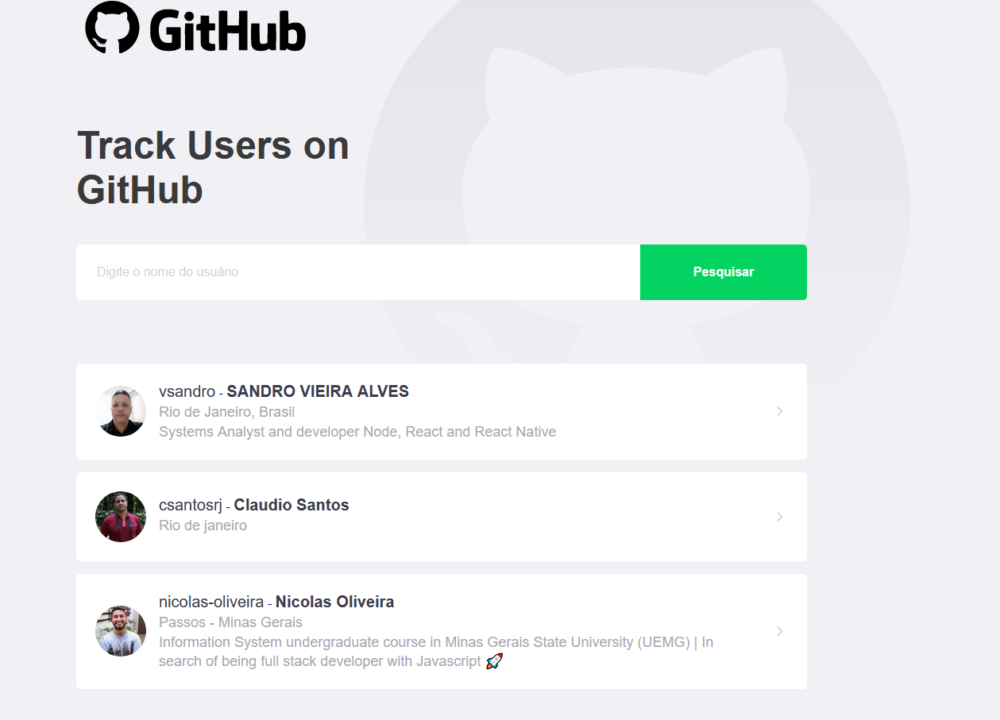

# GitHubRepository
Sistema desenvolvido em **Node.js** 

<p align='center'>
 
</p>


## 1. Introdução

Aplicação desenvolvida em **Node.js** para acesso a API pública do GitHub.

<p align='center'>
 
</p>

## 2. Tecnologias (Techs)

- NodeJs
- styled-components
- localStorage
- react-router-dom
- useState, useEffect


## 4. Funcionalidades

- Adiciona usuário do GitHub que deseja acompanhar;
- Visualiza todos os repositórios públicos de um usuário;
- Visualiza quem o usuário segue no GitHub.

<p align='center'>
 
 

</p>


## 5. Instalação e execução. :octocat:

- [Clone](https://help.github.com/articles/cloning-a-repository/) o projeto na sua máquina executando o seguinte comando no seu terminal:

```sh
git clone https://github.com/vsandro/GitHubRepository.git
```

- Instale as dependências do projeto com o comando:

```sh
cd Github
yarn
```

- Rode o projeto na sua máquina com:

```sh
yarn start
```


```sh
http://localhost:3000
```

## 6. Autoria

Este projeto foi desenvolvido por [Sandro Vieira](https://www.linkedin.com/in/vsandro) baseado em uma aplicação de acesso ao GitHub do Bootcamp GoStack da Rocketseat.


